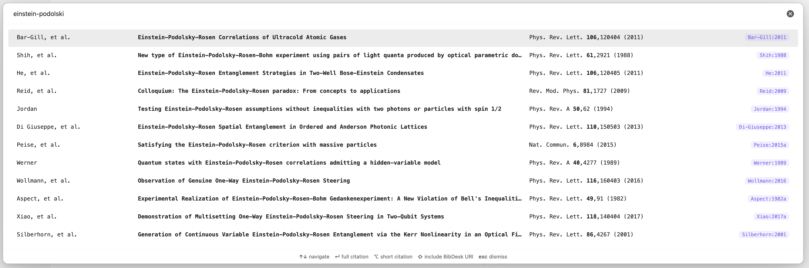
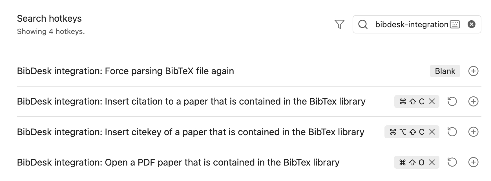

# BibDesk Integration Plugin for Obsidian

This plugin integrates BibTeX libraries with the [PDF++](https://github.com/RyotaUshio/obsidian-pdf-plus) plugin in Obsidian, enabling you to manage and open PDFs associated with bibliography entries directly from Obsidian. It works with external BibTeX files, parsing them in the background for a seamless experience.

> [!NOTE]
> This plugin works with any standard BibTeX library. However, some features are designed specifically for libraries maintained with [BibDesk](https://en.wikipedia.org/wiki/BibDesk) on macOS, such as resolving `bdsk-file-<NUMBER>` fields — macOS bookmarks that allow seamless file access even if files are renamed or moved.

Unlike most BibTeX plugins for Obsidian, this plugin is designed to handle **large libraries with 10,000+ papers**:
- parsing runs on a dedicated background thread to keep the UI responsive (no freezing, not even for an instant)
- using a **custom high-performance parser** built with [Peggy](https://peggyjs.org/) makes parsing large BibTex files faster than any TypeScript-based BibTeX parsers I could test, and even BibDesk's own parser.


### Additional Features
- **Automatic reloading**: The BibTeX library is also watched for changes and re-parsed automatically in the background whenever the `bib` file is updated 
- **External Library Support**: Your BibDesk library does not need to reside within your Obsidian vault, making it ideal for large libraries (several GBs).
- **Integration with PDF++**: Opens PDFs stored outside your Obsidian vault via the PDF++ plugin.

### Screenshots
**Configuration Pane**  


**Fuzzy Search Modal for Paper Selection**  


**Recommended Hotkeys**  


## Installation

To install the plugin manually, follow these steps:

1. **Clone the Repository**:
   ```bash
   git clone https://github.com/alberti42/obsidian-bibdesk-integration.git
   ```
2. **Install Node.js Packages**:
   ```bash
   npm install
   ```
3. **Generate the Parser for BibTeX Files**:
   ```bash
   npm run grammar
   ```
4. **Build the macOS Bookmark Resolver**:
   ```bash
   npm run bookmark_resolver
   ```
   > Ensure you have the `swiftc` compiler available via the command line. Refer to Xcode’s documentation if needed.

5. **Transpile the Plugin**:
   ```bash
   npm run build
   ```
6. **Verify Output**: Ensure that the `dist` folder contains `styles.css`, `bookmark_resolver`, `main.js`, and `manifest.json`.
7. **Copy or Link Plugin Files to Obsidian**:
   - Create the plugin folder in your vault:
     ```bash
     mkdir -p <YOUR_VAULT_FOLDER>/.obsidian/plugins/bibdesk-integration
     ```
   - Copy or create symbolic links from the `dist` folder to the plugin folder created in step 7. This is helpful if you plan to further develop the plugin.

## Support the Project
If you find this plugin helpful, consider supporting its development:

[](https://buymeacoffee.com/alberti)

## About the Author
- **Author:** Andrea Alberti
- **GitHub:** [alberti42](https://github.com/alberti42)
- **Donations:** [](https://buymeacoffee.com/alberti)

Please feel free to contribute or report any issues in the [GitHub repository](https://github.com/alberti42/obsidian-bibdesk-integration/issues).
