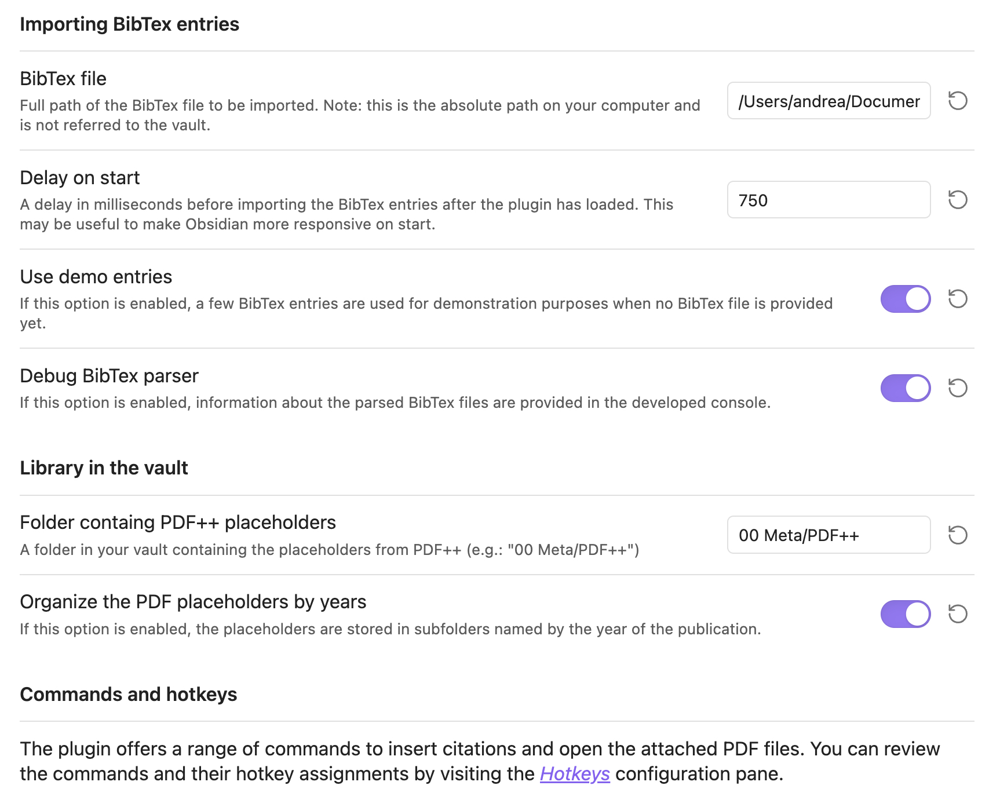

# Obsidian BibDesk Integration

⚠️ **Note:** This plugin supports general BibTeX parsing, but it’s optimized for libraries created with [BibDesk](https://en.wikipedia.org/wiki/BibDesk) on macOS.

This plugin integrates the macOS BibDesk application with the [PDF++](https://github.com/RyotaUshio/obsidian-pdf-plus) plugin in Obsidian, enabling you to manage and open PDFs associated with BibDesk entries directly from Obsidian. It works with external BibTeX files, leveraging BibDesk’s `bdsk-file-<NUMBER>` fields, which act as macOS bookmarks, allowing seamless file access even if files are renamed or moved.

### Features
- **External Library Support**: Your BibDesk library does not need to reside within your Obsidian vault, making it ideal for large libraries (several GBs).
- **Optimized BibTeX Parser**: A custom BibTeX parser, faster than alternatives available for TypeScript and even BibDesk's own parser. Parsing occurs on a separate thread, ensuring minimal latency for Obsidian.
- **Integration with PDF++**: Opens PDFs stored outside your Obsidian vault via the PDF++ plugin.

### Screenshots
**Configuration Pane**  


**Fuzzy Search Modal for Paper Selection**  


**Recommended Hotkeys**  


## Installation

To install the plugin manually, follow these steps:

1. **Clone the Repository**:
   ```bash
   git clone https://github.com/alberti42/obsidian-bibdesk-integration.git
   ```
2. **Install Node.js Packages**:
   ```bash
   npm install
   ```
3. **Generate the Parser for BibTeX Files**:
   ```bash
   npm run grammar
   ```
4. **Build the macOS Bookmark Resolver**:
   ```bash
   npm run bookmark_resolver
   ```
   > Ensure you have the `swiftc` compiler available via the command line. Refer to Xcode’s documentation if needed.

5. **Transpile the Plugin**:
   ```bash
   npm run build
   ```
6. **Verify Output**: Ensure that the `dist` folder contains `styles.css`, `bookmark_resolver`, `main.js`, and `manifest.json`.
7. **Copy or Link Plugin Files to Obsidian**:
   - Create the plugin folder in your vault:
     ```bash
     mkdir -p <YOUR_VAULT_FOLDER>/.obsidian/plugins/bibdesk-integration
     ```
   - Copy or create symbolic links from the `dist` folder to the plugin folder created in step 7. This is helpful if you plan to further develop the plugin.

## Support the Project
If you find this plugin helpful, consider supporting its development:

[](https://buymeacoffee.com/alberti)

## About the Author
- **Author:** Andrea Alberti
- **GitHub:** [alberti42](https://github.com/alberti42)
- **Donations:** [](https://buymeacoffee.com/alberti)

Please feel free to contribute or report any issues in the [GitHub repository](https://github.com/alberti42/obsidian-bibdesk-integration/issues).
